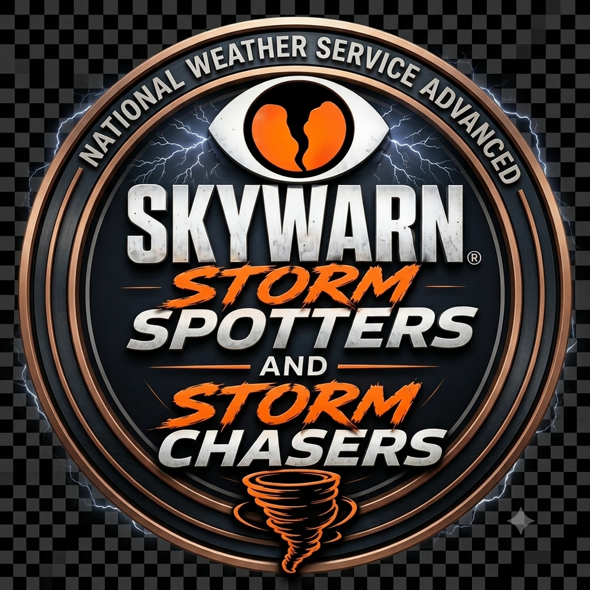
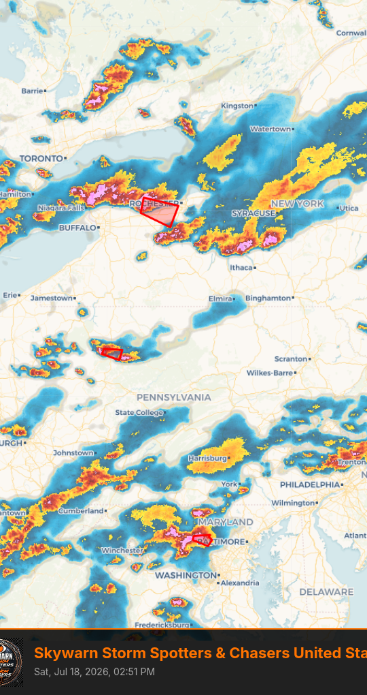
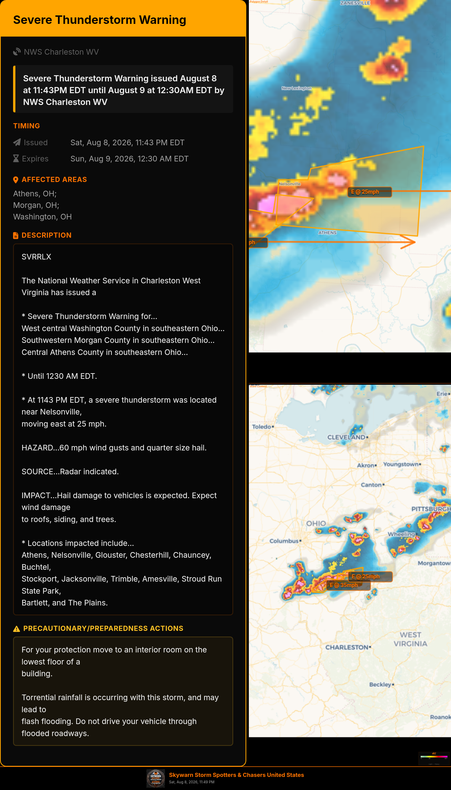
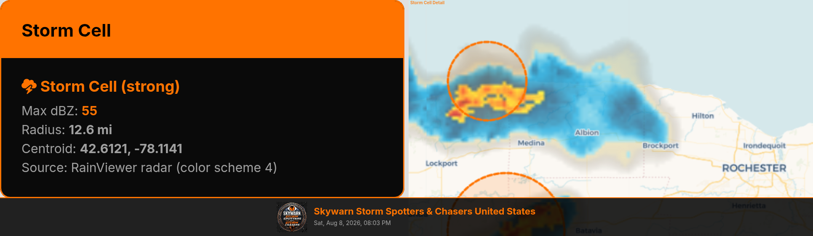
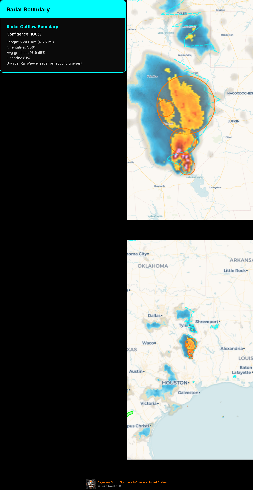
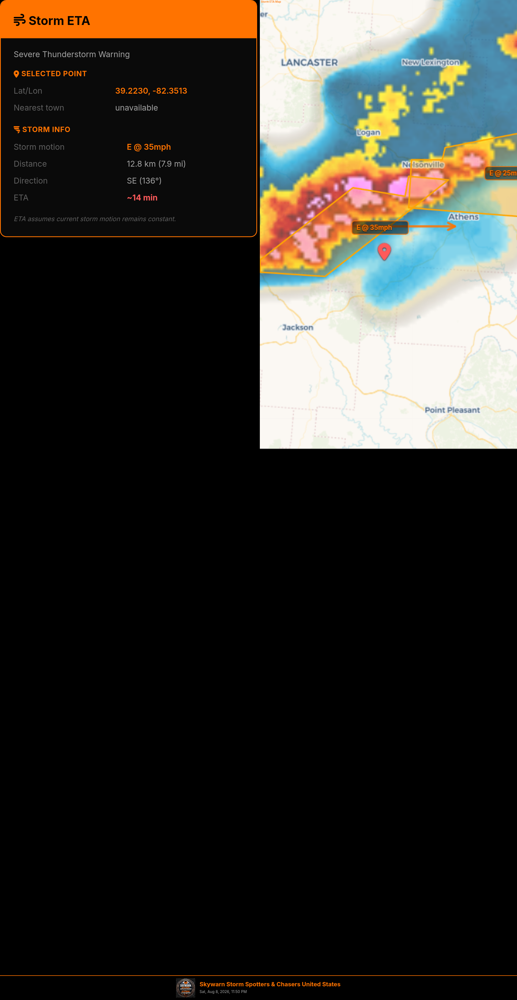
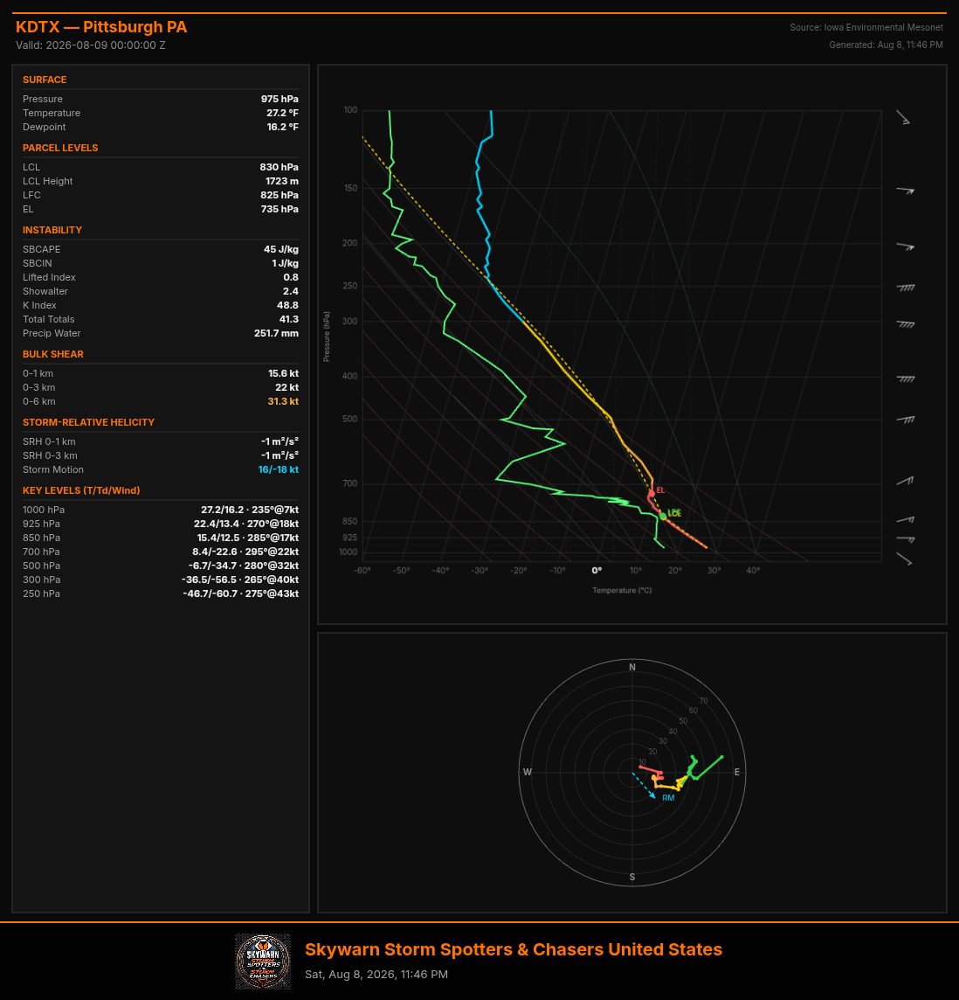
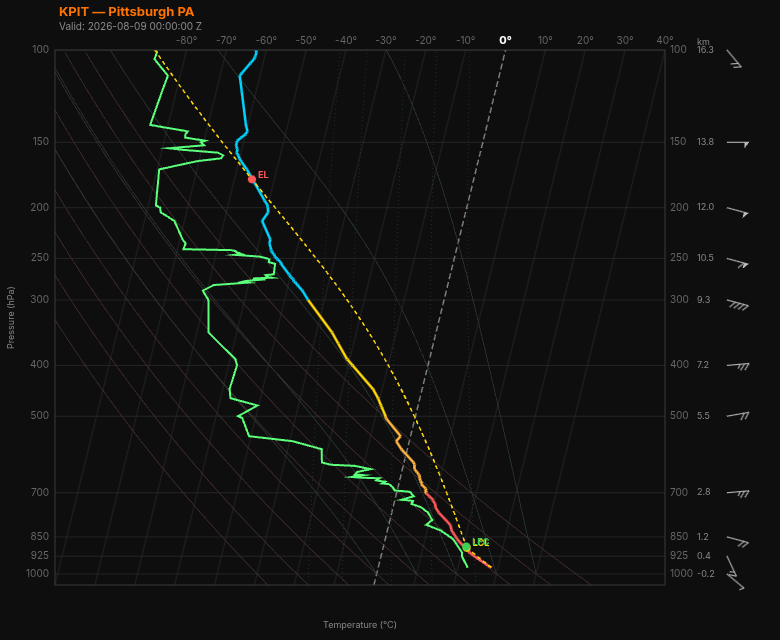

<p align="center">
  
</p>

<h1 align="center">Skywarn Storm Spotters & Chasers United States</h1>

<p align="center">
  A field-grade Progressive Web App for storm spotters, chasers, and rural communities.<br>
  Built for unreliable connectivity, battery-constrained field use, and life-critical situational awareness.
</p>

[](https://kn-weather.github.io/Skywarn-Storm-Spot-US/)
[](https://github.com/Kn-weather/Skywarn-Storm-Spot-US/releases)
[](https://github.com/Kn-weather/Skywarn-Storm-Spot-US/actions/workflows/collect-obs.yml)
[](https://github.com/Kn-weather/Skywarn-Storm-Spot-US/commits/main)
[](https://github.com/Kn-weather/Skywarn-Storm-Spot-US)
[](https://github.com/Kn-weather/Skywarn-Storm-Spot-US/blob/main/LICENSE)

[](https://github.com/Kn-weather/Skywarn-Storm-Spot-US#why-the-pwa-architecture-matters-for-storm-spotters)
[](https://supabase.com/)
[](https://leafletjs.com/)
[](https://www.rainviewer.com/)
[](https://earthdata.nasa.gov/gibs)
[](https://mesonet.agron.iastate.edu/)
[](https://www.weather.gov/documentation/services-web-api)
[](https://nodejs.org/)

A comprehensive weather monitoring PWA for storm spotters and chasers, featuring live NWS alert polygons, SPC outlooks, radar animation, satellite imagery, soundings, surface observations, outflow boundary detection, radar-based storm cell tracking, storm-safe navigation, and a spotting journal with Supabase backend.

> **Architecture Highlight:** Built as a Progressive Web App for offline resilience, battery efficiency, and small data packets — a field-grade tool designed to keep storm chasers and rural communities connected when infrastructure fails. [Read the full reasoning →](#why-the-pwa-architecture-matters-for-storm-spotters)

**Live Site:** [https://kn-weather.github.io/Skywarn-Storm-Spot-US/](https://kn-weather.github.io/Skywarn-Storm-Spot-US/) · **Latest Release:** [v91](https://github.com/Kn-weather/Skywarn-Storm-Spot-US/releases) · **Report a Bug:** [Issues](https://github.com/Kn-weather/Skywarn-Storm-Spot-US/issues) · **Changelog:** [CHANGELOG.md](CHANGELOG.md) · **Bug Fixes:** [BUG_FIXES.md](BUG_FIXES.md)

## Table of Contents

- [Screenshots](#screenshots)
- [Features](#features)
- [Technology Stack](#technology-stack)
- [PWA Support](#pwa-support)
- [Quick Start](#quick-start)
- [Project Structure](#project-structure)
- [Database Schema](#database-schema)
- [GitHub Actions (24/7 Data Collection)](#github-actions-247-data-collection)
- [Contributing](#contributing)
- [Roadmap](#roadmap)
- [Planned Features](#planned-features)
- [Standalone Files](#standalone-files)
- [Data Sources](#data-sources)
- [Acknowledgments](#acknowledgments)
- [References](#references)
- [License](#license)
- [Why the PWA Architecture Matters](#why-the-pwa-architecture-matters-for-storm-spotters)

## Screenshots

### Alert Map — Live NWS Warning Polygons
<p align="center">
  
</p>

### Severe Thunderstorm Warning Detail
<p align="center">
  
</p>

### Radar Storm Cell Detection
<p align="center">
  
</p>

### Radar Boundary Detection
<p align="center">
  
</p>

### Storm-Safe Navigation — Storm ETA
<p align="center">
  
</p>

### Sounding Collage — Detroit (KDTX)
<p align="center">
  
</p>

### Sounding Collage — Pittsburgh (KPIT)
<p align="center">
  
</p>

## Features

### Polygon Map (Main Tab)
- **Live NWS Alert Polygons** — Tornado Warnings, Severe Thunderstorm Warnings, Watches, Advisories with delta updates (only adds/removes changed alerts). State-filtered for fast loading; nationwide when no state selected
- **Alert Attributes** — Hail size, tornado detection, max wind markers on warning polygons (in Alert Categories section)
- **SPC Information** — Day 1-3 convective outlooks (categorical + tornado/hail/wind probability layers) + Mesoscale Discussion polygons with full discussion text, auto-refresh every 5 min, zoom-to-polygon screenshots
- **Radar Overlay** — RainViewer API with 3-layer rolling buffer for smooth animation, play/pause/step controls, dBZ legend
- **Satellite Layers** — NASA GIBS GOES-East/West ABI imagery (GeoColor, Infrared Band 13, Visible Band 2, Air Mass, Dust) with 24-frame 3-layer rolling buffer animation (last 4 hours, 10-min intervals), opacity control, brightness-temperature legend for IR/Air Mass, auto-refresh every 10 minutes. Two-dropdown UI (Satellite + View Type) for compact panel
- **Surface Observations** — NWS ASOS station data with 9 weather variables (temp, dewpoint, wind, pressure, visibility, RH, precip), color-coded markers, and IDW gradient heatmap overlay with NWS-standard color ramps. State-filtered for performance (controls hidden until state selected). Gradient clipped to state bounding box
- **Outflow Boundary Detection (ASOS-based)** — Detects surface outflow boundaries from ASOS observation gradients (ΔT ≥ 4°F, ΔTd ≥ 3°F, wind shift ≥ 30°). Limited to 75mi radius of tracked storms, forward-direction filtered, minimum 2 clusters, max 15 pairs per cluster (noise filter). Piecewise-linear cyan dashed polylines with confidence scores, PCA-based clustering
- **Observation Animation** — Play through stored observation snapshots (Supabase-backed) with speed control, pin + gradient animation
- **Warnings Motion Direction** — Tracks warned storms (NWS polygon centroids) and draws motion arrows with semi-transparent labels at the origin. Click the map for Storm ETA popup with nearest town (NWS /points API reverse geocoded), positioned below the clicked point with a pin marker. 5-second timeout on reverse geocode
- **Radar Storm Cell Detection** — Client-side radar processing pipeline: decodes RainViewer PNG tiles to dBZ via canvas getImageData (CORS-enabled), segments storm cells (≥40 dBZ) using 8-way connected-component labeling, computes centroid/radius/max dBZ/severity. Renders as colored circles (yellow/orange/red/magenta by severity). Motion tracking across radar frames with projected positions (+10/+20/+30 min). Auto-refreshes every 5 min
- **Radar Outflow Boundaries** — Detects fine-line boundaries from radar reflectivity gradients (gradX/gradY magnitude ≥ 8 dBZ). Connected-component labeling + PCA line fit + Douglas-Peucker simplification. Cyan dashed polylines with confidence scores. Separate toggle from storm cell detection. Adjustable noise filter slider (0-90, 500ms debounce)
- **Storm-Safe Navigation** — Calculates driving routes that avoid active storm cells and warning polygons. Features:
  - Radar storm cell integration (uses radar-detected cells ≥50 dBZ as primary hazard source, NWS polygons as fallback)
  - Predictive avoidance (projects storm forward by drive time using radar motion data)
  - Drive ETA + Storm ETA comparison with "storm arrives before you" warnings
  - Custom no-go zone drawing (user-drawn purple polygons)
  - Pick-on-map for start/destination points (pin buttons + GPS)
  - Google Maps + Apple Maps deep link generation with safe waypoints
  - Buffer slider (3-15 mi), storm cell radius (2-50 mi), drive speed (35-75 mph)
  - Color-coded hazard rendering: cyan (radar cells), orange (NWS storm cells), red (NWS polygons), purple (no-go zones)
- **Sounding Station Pins** — 68 NWS upper-air sites with click-to-view skew-T popups
- **Tornado Tracker Mode** — Auto-zoom to newly issued Tornado Warnings (Settings)
- **Screenshots** — Every popup type has a screenshot button: alert polygons (zoom-to-polygon), Storm ETA (with pin visible), Mesoscale Discussions (zoom-to-polygon, full discussion text expanded), SPC outlooks, surface observations, outflow boundaries, radar storm cells, radar boundaries. Composites info panel + map + Skywarn branding footer. Download, share to Facebook/Discord, or add to journal
- **App Version Display** — Shows current version (from sw.js CACHE_NAME) + latest commit info from GitHub API in Settings. Yellow update banner when new version detected
- **Share** — Facebook, Discord, native Web Share API
- **Collapsible Layers Panel** — All layer sections collapsible with persisted state. Sections: Alert Categories, Surface Obs, SPC Information, Radar Overlay, Satellite Layers, Sounding Stations, Storm Motion (Warnings Motion Direction, Outflow Boundaries, Radar Storm Cell Detection, Radar Outflow Boundaries), Storm-Safe Navigation
- **Collapsible Alert Legend** — Active alerts grouped by category (Warnings/Watches/Advisories)

### Soundings Tab
- **Skew-T / Log-P Diagram** — Full NWS/NOAA-standard rendering with canvas clipping
  - Isobars (log-P, 1000 hPa bottom → 100 hPa top)
  - Isotherms (skewed SW to NE, labeled at bottom, 0°C highlighted)
  - Dry adiabats (solid, SE to NW, correct θ formula)
  - Moist adiabats (curved, every 10°C)
  - Mixing ratio lines (dashed, 1/2/5/10/20 g/kg)
  - Temperature trace (color-coded by altitude: red/orange/yellow/cyan)
  - Dewpoint trace (green)
  - Parcel ascent with LCL/LFC/EL markers
  - Wind barbs at standard pressure levels
  - Height scale (km AGL) on right side
- **Hodograph** — Color-coded by altitude, Bunkers right-mover storm motion, range rings
- **Derived Parameters** — CAPE, CIN, LI, Showalter, K Index, Total Totals, PW, bulk shear (0-1/0-3/0-6 km), SRH (0-1/0-3 km), key level winds
- **Legend & Instructions** — Collapsible panel with how-to-read guide
- **TwisterData Integration** — Embedded forecast sounding map for arbitrary points
- **Screenshot** — Collage: data panel left, skew-T top-right, hodograph bottom-right, branding footer
- **Standalone Page** — `soundings.html` can be used independently on any website

### Spotting Journal Tab
- **Observation Diary** — Track weather observations across multiple chase days/events
- **Manual Entry** — Temp, dewpoint, wind, pressure, sky conditions, notes
- **NWS Auto-fill** — Geolocation → NWS /points API → nearest ASOS station → auto-fill weather data
- **Location Options** — Browser GPS, place name lookup (OpenStreetMap Nominatim), click-on-map, manual lat/lon
- **Photo Upload** — Sky/feature photos stored in Supabase Storage
- **Radar Screenshots** — Capture current map view and attach to journal entries
- **Alert Screenshot → Journal** — "+ Journal" button in screenshot preview modal
- **Time-Series Graph** — Canvas chart for temp/dewpoint/pressure/wind over time
- **Mini-Map** — Entry locations with popups
- **Edit/Delete** — Owner-only (requires authentication)
- **Multi-User** — Supabase Auth with Google OAuth, Facebook OAuth (pending verification), and magic link

### Weatherfront Tab
- Embedded Weatherfront interactive dashboard

### StormCams Tab
- Storm camera network (placeholder)

### Weather Feeds Tab
- SPC PDS feed, WPC feed, NHC feed with images

### Lightning Map Tab
- Blitzortung real-time lightning map (embedded)

### Spotter Safety Tab
- ACES concept (Awareness, Communication, Escape Routes, Safe Zones)
- Core safety guidelines from COMET/UCAR

### Reference Library Tab
- SKYWARN meteorological terms, cloud types, radar terms, severe weather, hydrology, winter weather, reporting criteria
- Beaufort Wind Scale video
- Category tabs with search, diagram placeholders

### Site Settings Tab
- User Account (Google/Facebook OAuth, magic link, sign out)
- Tornado Tracker Mode toggle
- Alert sounds (Tornado Warning/Watch)
- App version display + update notification banner
- Update log / console
- Hard refresh / app update

## Technology Stack

| Component | Technology |
|-----------|-----------|
| Frontend | Single HTML file (~16,000+ lines), vanilla JavaScript |
| Map | Leaflet.js 1.9.4 with CARTO Voyager basemap |
| Radar | RainViewer API with 3-layer rolling buffer + canvas pixel decoding |
| Satellite | NASA GIBS WMTS (GOES-East/West ABI imagery) |
| Geospatial | turf.js 7.0.0 (polygon buffering, intersection detection, routing) |
| Alerts | NWS API (api.weather.gov) with direct fetch + CORS proxy fallback |
| Soundings | Iowa Environmental Mesonet (Iowa State University) RAOB JSON API |
| SPC Outlooks | spc.noaa.gov GeoJSON API |
| SPC Mesoscale Discussions | spc.noaa.gov HTML parsing (LAT...LON coordinate decoding) |
| Observations | NWS ASOS stations via api.weather.gov |
| Reverse Geocoding | NWS /points API (nearest city/state for Storm ETA) |
| Radar Processing | Canvas getImageData on RainViewer tiles (CORS-enabled) |
| Backend | Supabase (PostgreSQL, Auth, Storage, Realtime) |
| Auth | Supabase Auth (Google OAuth, Facebook OAuth, magic link) |
| PWA | manifest.json, service worker (network-first HTML, cache-first static) |
| Screenshots | html2canvas with canvas-based compositing |
| Data Collection | GitHub Actions cron (every 30 min) + client-side snapshots |

## PWA Support

- Installable on iOS/Android/desktop
- Service worker with network-first HTML strategy
- Offline-capable (cached assets, offline fallback page)
- Safe-area insets for notched devices
- Cache versioning for seamless updates
- App version display + update notification in Settings

> See [Why the PWA Architecture Matters for Storm Spotters](#why-the-pwa-architecture-matters-for-storm-spotters) at the end of this document for the architectural reasoning behind this choice.

## Database Schema

### journal_events
Groups journal entries by chase day or storm system.

### journal_entries
Individual storm spotting observations with weather variables, photos, and radar screenshots.

### obs_snapshots
Surface observation snapshots for animated gradient playback. Auto-cleaned after 24 hours.

**SQL files:**
- `supabase_schema.sql` — Journal tables + RLS + storage bucket
- `obs_snapshots_schema.sql` — Observation snapshots table + RLS + cleanup function
- `obs_cron_schedule.sql` — pg_cron schedule for Edge Function (optional)

## GitHub Actions (24/7 Data Collection)

- `.github/workflows/collect-obs.yml` — Runs every 30 minutes
- `scripts/collect-obs.mjs` — Fetches NWS observations for all CONUS states, stores to Supabase
- Requires repository secrets: `SUPABASE_URL`, `SUPABASE_SERVICE_KEY`
- Can also be triggered manually from the Actions tab

## Project Structure

```
Skywarn-Storm-Spot-US/
├── index.html                    # Main app (single-file PWA, ~16,000+ lines)
├── soundings.html                # Standalone skew-T soundings page
├── sw.js                         # Service worker (offline caching)
├── manifest.json                 # PWA manifest
├── package.json                  # Node.js deps (@supabase/supabase-js, ws)
├── package-lock.json             # Pinned dependency versions
├── .npmrc                        # GitHub Packages registry config
├── skywarn-logo.png              # App logo
├── BUG_FIXES.md                  # Bug fix log with root cause analysis
├── CHANGELOG.md                  # Version history with feature highlights
├── PLANNED_FEATURES.md           # Detailed plans for upcoming features
├── LICENSE                       # All Rights Reserved proprietary license
├── CLA.md                        # Contributor License Agreement
├── .gitignore                    # Git ignore rules (deps, secrets, OS/IDE files)
├── README.md                     # This file
├── .github/
│   ├── workflows/
│   │   └── collect-obs.yml       # GitHub Actions (every 30 min data collection)
│   ├── pull_request_template.md  # PR template (CLA confirmation, testing checklist)
│   └── ISSUE_TEMPLATE/
│       ├── bug_report.md         # Bug report template
│       └── feature_request.md    # Feature request template
├── scripts/
│   └── collect-obs.mjs           # NWS observation collector (Node.js)
├── supabase/
│   ├── schema.sql                # Journal tables + RLS + storage bucket
│   ├── obs_snapshots_schema.sql  # Observation snapshots table + RLS
│   ├── obs_cron_schedule.sql     # pg_cron schedule (optional)
│   └── functions/
│       └── collect-obs/
│           └── index.ts          # Supabase Edge Function (Deno)
├── docs/
│   └── screenshots/              # App screenshots for README
└── media/
    └── beaufort_scale.mp4        # Beaufort Wind Scale training video
```

### Key Architecture Decisions

- **Single HTML file** — The entire app (`index.html`) is one file (~16,000+ lines of vanilla JavaScript). This is intentional for the PWA architecture: minimal requests, fast caching, and no build step. See [Why the PWA Architecture Matters](#why-the-pwa-architecture-matters-for-storm-spotters).
- **No build tooling** — No webpack, no babel, no TypeScript compilation for the frontend. The app runs directly in the browser.
- **Node.js scripts only for backend tasks** — The `scripts/` directory contains Node.js code for data collection (runs in GitHub Actions or Supabase Edge Functions), not for the frontend.
- **Supabase for backend** — PostgreSQL, Auth, Storage, and Realtime are all handled by Supabase, eliminating the need for a custom backend server.

## Quick Start

### For Users

Just visit the [live site](https://kn-weather.github.io/Skywarn-Storm-Spot-US/). No installation required — it's a PWA that can be installed to your home screen on iOS, Android, or desktop.

### For Developers (Local Development)

#### Prerequisites

- [Node.js](https://nodejs.org/) ≥ 18 (for data collection scripts and GitHub Actions)
- A modern browser (Chrome, Firefox, Safari, Edge)
- A Supabase account (free tier works) — only needed for journal/auth features

#### Steps

1. **Clone the repository**
   ```bash
   git clone https://github.com/Kn-weather/Skywarn-Storm-Spot-US.git
   cd Skywarn-Storm-Spot-US
   ```

2. **Install Node.js dependencies** (for data collection scripts)
   ```bash
   npm install
   ```

3. **Run the app** — open `index.html` in a browser, or serve with any static server:
   ```bash
   # Option A: Python
   python3 -m http.server 8000
   
   # Option B: Node.js (npx)
   npx serve
   ```
   Then visit `http://localhost:8000` (or whichever port your server uses).

4. **Configure Supabase** (only needed for journal/auth features):
   - Create a project at [supabase.com](https://supabase.com/)
   - Run `supabase_schema.sql` and `obs_snapshots_schema.sql` in your Supabase SQL editor
   - Set `SUPABASE_URL` and `SUPABASE_ANON_KEY` in the JavaScript (search for `USER CONFIG` in `index.html`)
   - Enable Email + Google providers in Supabase Dashboard → Authentication → Providers

5. **Set up 24/7 observation collection** (optional):
   - Add `SUPABASE_URL` and `SUPABASE_SERVICE_KEY` as repository secrets (GitHub Settings → Secrets → Actions)
   - The workflow runs automatically every 30 minutes via GitHub Actions
   - Or deploy the Supabase Edge Function: `npm run deploy:function`

#### Verify Your Setup

- ✅ App loads at `http://localhost:8000` with the map visible
- ✅ Alert polygons appear (if there are active NWS alerts)
- ✅ Radar overlay animates when enabled
- ✅ Settings tab shows the app version
- ✅ Journal tab works (requires Supabase configuration)

## Standalone Files

- `soundings.html` — Self-contained skew-T soundings page (no app dependencies). Can be deployed independently on any website.
- `supabase/functions/collect-obs/index.ts` — Supabase Edge Function for observation collection (optional alternative to GitHub Actions). Runs on Deno runtime.

## Contributing

We welcome contributions from beta testers and co-developers! This project serves a mission-critical community — storm spotters and rural chasers — so code quality and reliability matter.

> **📋 Contributor License Agreement:** By submitting a pull request, you agree to the terms of our [CLA](CLA.md). Please read it before your first contribution. The CLA ensures you retain ownership of your work while granting us permission to use, modify, and distribute your contributions under our proprietary license.

### Reporting Bugs

1. Check the [existing issues](https://github.com/Kn-weather/Skywarn-Storm-Spot-US/issues) to avoid duplicates
2. Open a new issue with the **Bug Report** template
3. Include: device, browser, OS version, steps to reproduce, expected vs. actual behavior, and screenshots if applicable
4. Note the app version (visible in Settings tab) and whether you're online/offline

### Suggesting Features

1. Open an issue with the **Feature Request** template
2. Describe the use case — who benefits and in what weather scenario
3. Explain how it aligns with the PWA architecture (offline-first, battery-efficient, small data)

### Development Workflow

1. **Fork** the repository
2. **Read the [CLA](CLA.md)** — submitting a PR constitutes agreement
3. **Create a branch**: `git checkout -b feature/your-feature-name` or `fix/your-bugfix-name`
4. **Make your changes** — keep the single-file architecture in mind for frontend changes
5. **Test thoroughly**:
   - Test in multiple browsers (Chrome, Firefox, Safari, Edge)
   - Test on mobile (install as PWA, test offline)
   - Test with active weather alerts if possible
   - Verify existing features still work (no regressions)
6. **Update documentation** if needed (README.md, CHANGELOG.md, BUG_FIXES.md)
7. **Bump the service worker cache version** (`sw.js` CACHE_NAME) if your change affects frontend code
8. **Commit with clear messages**: `feat: add X`, `fix: resolve Y`, `docs: update Z`
9. **Open a Pull Request** — the PR template will prompt you to confirm CLA agreement, describe what changed, and verify testing

### Code Style

- **Frontend**: Vanilla JavaScript, no build step. Follow existing patterns in `index.html`. Use clear variable names, comment complex algorithms.
- **Node.js scripts**: ES modules (`import`/`export`). Follow existing patterns in `scripts/collect-obs.mjs`.
- **SQL**: Lowercase keywords, uppercase table names. Include RLS policies for any new tables.
- **Commits**: Use [conventional commits](https://www.conventionalcommits.org/) (`feat:`, `fix:`, `docs:`, `chore:`, `ci:`, `security:`)

### Areas Needing Help

- **StormCams network** — Currently a placeholder; needs camera integration
- **Mobile testing** — iOS Safari PWA quirks need thorough testing
- **Performance** — Radar pixel decoding is CPU-intensive; optimization welcome
- **Accessibility** — Screen reader support, keyboard navigation
- **Documentation** — User guide, feature tutorials, meteorological explanations

### Beta Tester Guidelines

If you're joining as a beta tester:

1. Install the PWA on your device (Add to Home Screen)
2. Use it during active weather events
3. Report bugs via [Issues](https://github.com/Kn-weather/Skywarn-Storm-Spot-US/issues) with screenshots
4. Share your use cases — what worked, what didn't, what you needed
5. Join the conversation in Discussions (coming soon)

## Roadmap

### Recently Shipped

- ✅ **v97:** Wind-validated outflow boundary detection (ASOS cross-validation)
- ✅ **v96:** Radar cell motion arrow time frame selector (15/30/60 min) + arrowheads
- ✅ **v95:** Point density slider for boundary line simplification (budget-based Douglas-Peucker)
- ✅ **v94:** Radar boundary noise slider fix + zig-zag cleanup (Douglas-Peucker)
- ✅ **v93:** Pixel-based blank frame detection for satellite animation
- ✅ **v92:** Satellite animation blank frame skipping
- ✅ **v91:** Radar storm cell detection with motion tracking, Storm-Safe Navigation, dual-source outflow boundaries, NASA GIBS satellite layers, SPC Mesoscale Discussions, Skew-T soundings, Spotting Journal, PWA architecture documentation

### In Progress

- 🔄 StormCams network integration
- 🔄 Facebook OAuth verification (pending Facebook review)
- 🔄 Performance optimization for radar pixel decoding
- 🔄 Mobile PWA testing across devices

### Planned

- 🔲 Real-time lightning layer (Blitzortung integration improvement)
- 🔲 Watch polygon visualization
- 🔲 Model data integration (HRRR, NAM, GFS)
- 🔲 Push notifications for Tornado Warnings
- 🔲 Offline map tiles for field use
- 🔲 Storm reporting submission to NWS
- 🔲 Chase log export (PDF, CSV)
- 🔲 Multi-language support

### Long-Term Vision

- 🔲 Community-driven storm camera network
- 🔲 AI-assisted storm feature detection from satellite/radar
- 🔲 Integration with amateur radio spotter networks
- 🔲 Training module for new spotters

## Planned Features

For detailed implementation plans of major upcoming features — including outflow boundary tracking with Kalman filters, MRMS + HRRR backend validation, push notifications, offline map tiles, and AI-assisted storm detection — see the **[PLANNED_FEATURES.md](PLANNED_FEATURES.md)** document.

That document consolidates this roadmap with technical architecture, phased implementation plans, and effort estimates for each major feature.

## Data Sources

- [NWS API](https://www.weather.gov/documentation/services-web-api) — Alerts, observations, station data, reverse geocoding
- [Iowa Environmental Mesonet](https://mesonet.agron.iastate.edu/) — RAOB soundings
- [SPC](https://www.spc.noaa.gov/) — Convective outlooks, Mesoscale Discussions
- [RainViewer](https://www.rainviewer.com/) — Radar tiles (CORS-enabled for pixel decoding)
- [NASA GIBS](https://earthdata.nasa.gov/gibs) — GOES-East/West satellite imagery (WMTS)
- [CARTO](https://carto.com/) — Basemap tiles
- [OpenStreetMap Nominatim](https://nominatim.openstreetmap.org/) — Geocoding (journal location lookup)
- [turf.js](https://turfjs.org/) — Geospatial analysis (polygon buffering, intersection detection, routing)
- [TwisterData](http://www.twisterdata.com/) — Forecast soundings (embedded)

## Acknowledgments

This project would not be possible without the incredible work of the meteorological community and open-data providers:

- **NOAA / NWS** — For providing public-domain weather data, alerts, and observations that power the core of this app. Their commitment to open access makes tools like this possible.
- **Storm Prediction Center (SPC)** — For convective outlooks, Mesoscale Discussions, and the PDS watch feed.
- **Iowa Environmental Mesonet (Iowa State University)** — For the RAOB sounding API that makes the skew-T feature possible.
- **NASA GIBS** — For free, open access to GOES-East/West satellite imagery that enables the satellite layers feature.
- **RainViewer** — For CORS-enabled radar tiles that power both the radar overlay and the client-side storm cell detection pipeline.
- **Supabase** — For the open-source backend platform (PostgreSQL, Auth, Storage, Realtime) that powers the spotting journal.
- **Leaflet.js** — For the mapping library that forms the foundation of the polygon map.
- **turf.js** — For geospatial analysis tools used in storm-safe navigation and polygon operations.
- **COMET/UCAR** — For SKYWARN spotter training materials referenced in the Spotter Safety tab.
- **Blitzortung** — For the real-time lightning detection network.
- **The SKYWARN community** — The volunteer storm spotters who report severe weather to the NWS, saving lives every year. This tool is built for you.

### Inspired By

- The culture of storm chasing and the importance of reliable, low-bandwidth tools in the field
- The PWA movement's promise of apps that work for everyone, regardless of device or connectivity
- The open-data philosophy that makes weather information freely accessible

## References

- [NOAA JetStream — Skew-T Log-P Diagrams](https://www.noaa.gov/jetstream/upperair/skew-t-log-p-diagrams)
- [NWS ZHU Training — Skew-T Parameters](https://www.weather.gov/source/zhu/ZHU_Training_Page/convective_parameters/skewt/skewtinfo.html)
- [COMET/UCAR — Role of the SKYWARN Spotter](https://www.comet.ucar.edu/)

## License

This software is proprietary. See the [LICENSE](LICENSE) file for the full "All Rights Reserved" license terms.

**Summary:**
- **Application code** — Copyright © 2026 Kinshi Now (KN Weather division). All Rights Reserved. No use, modification, or distribution without written permission.
- **Weather data** — Provided by NOAA/NWS (public domain), NASA GIBS, SPC, Iowa Mesonet, and RainViewer under their respective terms.
- **Contributions** — Welcome but require a Contributor License Agreement (see [Contributing](#contributing) and the [LICENSE](LICENSE) file).

For licensing inquiries, open an [issue](https://github.com/Kn-weather/Skywarn-Storm-Spot-US/issues).

## Repository

- **Business:** Kinshi Now (KN Weather division)
- **GitHub:** [Kn-weather/Skywarn-Storm-Spot-US](https://github.com/Kn-weather/Skywarn-Storm-Spot-US)
- **Live Site:** [https://kn-weather.github.io/Skywarn-Storm-Spot-US/](https://kn-weather.github.io/Skywarn-Storm-Spot-US/)
- **Standalone Soundings:** [https://kn-weather.github.io/Skywarn-Storm-Spot-US/soundings.html](https://kn-weather.github.io/Skywarn-Storm-Spot-US/soundings.html)

---

## Why the PWA Architecture Matters for Storm Spotters

### Core Purpose

The Skywarn Storm Spotters PWA is designed to be more than just a weather app. It is a field-grade tool built for storm chasers and rural communities where connectivity and power are unreliable. The architecture choice — Progressive Web App (PWA) — is intentional and mission-critical.

### Strengths of the PWA Approach

- **Offline resilience** — Service workers cache maps, alerts, and discussions, ensuring situational awareness even during total outages or tower failures.
- **Battery efficiency** — Lightweight JavaScript and selective updates minimize drain, allowing devices to last longer in the field.
- **Small data packets** — Updates are delivered in tiny increments, critical when towers are overloaded or rural bandwidth is minimal.
- **Instant updates** — Bug fixes and improvements can be pushed immediately without app store delays, keeping the tool reliable during active weather.

### Why It's Worth Fighting For

- **Safety first:** Chasers depend on uninterrupted access to alerts and maps. A native app might offer smoother APIs, but it risks heavier battery use and larger data payloads — unacceptable in life-critical scenarios.
- **Accessibility:** PWAs run on any modern browser, lowering barriers for rural communities where device diversity is high.
- **Resilience under stress:** When towers are congested or damaged, the PWA's caching and lightweight design keep information flowing.
- **Operational trust:** Spotters know they can rely on the app even in worst-case conditions. That trust is built on the PWA's architecture.

### Lessons Learned

- The PWA path is harder — browser quirks, API limits, and performance ceilings demand constant vigilance.
- But the payoff is unique: a tool that works when nothing else does.
- The "easy way" (native app only) might reduce bugs, but it sacrifices the offline, battery-light resilience that keeps people safe.

### Conclusion

The PWA architecture is both the greatest strength and greatest challenge of the Skywarn Storm Spotters app. It is worth the fight because it aligns directly with the mission: to keep storm chasers and rural communities safe, informed, and connected even when the infrastructure fails.
